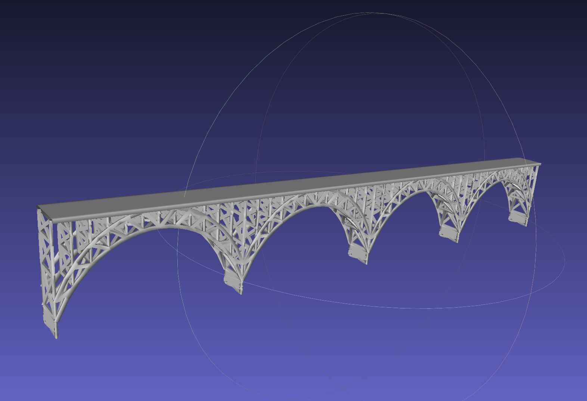

# IRIS-U^2 (Incremental Random Inspection-roadmap Search Under Uncertainty)

This is code for the paper **Inspection planning under execution uncertainty**. To cite this work, please use:

```
@article{alpert2023inspection,
  title={Inspection planning under execution uncertainty},
  author={Alpert, Shmuel David and Solovey, Kiril and Klein, Itzik and Salzman, Oren},
  journal={arXiv preprint arXiv:2309.06113},
  year={2023}
}
```

Link to the paper: [arXiv version](https://arxiv.org/pdf/2309.06113.pdf).

## Based on the IRIS algorithm

1. Science and Systems (RSS) 2019 paper *Toward Asymptotically-Optimal Inspection Planning via Efficient Near-Optimal Graph Search*. [[Paper](http://www.roboticsproceedings.org/rss15/p57.html)][[arXiv](https://arxiv.org/pdf/1907.00506.pdf)]

2. Extended code for IEEE International Conference on Robotics and Automation (ICRA) 2021 paper *Computationally-Efficient Roadmap-based Inspection Planning via Incremental Lazy Search*. [[Paper](https://ieeexplore.ieee.org/document/9561653)][[arXiv](https://arxiv.org/pdf/2103.13573.pdf)]

The original code can be found here: [[code](https://github.com/UNC-Robotics/IRIS)].

## Inspection planning under execution uncertainty

Autonomous inspection tasks necessitate path-planning algorithms to efficiently gather observations from points of interest (POI). However, localization errors commonly encountered in urban environments can introduce execution uncertainty, posing challenges to successfully completing such tasks. Unfortunately, existing algorithms for inspection planning do not explicitly account for execution uncertainty, which can hinder their performance. To bridge this gap, we present IRIS-under uncertainty (IRIS-U^2), the first inspection-planning algorithm that offers statistical guarantees regarding coverage, path length, and collision probability. Our approach builds upon IRIS---our framework for deterministic inspection planning, which is highly efficient and provably asymptotically-optimal. The extension to the much more involved uncertain setting is achieved by a refined search procedure that estimates POI coverage probabilities using Monte Carlo (MC) sampling.}The efficacy of IRIS-U^2 is demonstrated through a case study focusing on structural inspections of bridges. Our approach exhibits improved expected coverage, reduced collision probability, and yields increasingly precise statistical guarantees as the number of MC samples grows. Furthermore, we demonstrate the potential advantages of computing bounded sub-optimal solutions to reduce computation time while maintaining statistical guarantees.

## Requirements

* [GCC(for Linux)](https://gcc.gnu.org/) - v7.4
* [Boost](https://www.boost.org/) - v1.68.0
* [CMake](https://cmake.org/) - v3.8
* [Eigen3](http://eigen.tuxfamily.org/index.php?title=Main_Page) - v3.3.4
* [OMPL](https://ompl.kavrakilab.org/) - the Open Motion Planning Library v1.6.0

## Installation


1. To install all the dependencies, download InstallIRISUUAndRequirements.sh and type:
	```
	chmod u+x InstallIRISRequirements 
	./InstallIRISUUAndRequirements.sh
	```
 In the 'InstallIRISUUAndRequirements.sh' you may update the path of ompl folder (based on the version of ompl - such that 'ompl-1.6.0')
2. Tested environment:

  * Ubuntu 18.04 (gcc 7.4.0)
  * Ubuntu 16.04 (gcc 7.4.0)
  * Ubuntu 14.04 (gcc 7.2.0)
  * Ubuntu 20.04.01 (gcc 9.4.0)
  * macOS Mojave Version 10.14.6 (clang-1001.0.46.4)
  * macOS Catalina Version 10.15 (clang-1100.0.33.8)
    
## Usage

1. Specify which scenario to use in ```include/global_common.h```:
	
	```
	#define USE_CRISP 0
	#define USE_PLANAR 0
	```

	If ```USE_CRISP``` is set to 1, then the CRISP robot is used.
	
	If ```USE_CRISP``` is set to 0 and ```USE_PLANAR``` is set to 1, then the planar robot is used.

	If both ```USE_CRISP``` and ```USE_PLANAR``` are set to 0, then the drone robot is used.

	This code extension is focused on the drone robot case of considering the execution uncertainty:
	The configuration for such a scenario is done by setting ```UAV_NAVIGATION_ERROR``` to 1 ```useBitSet``` to 0 and ```useIPV``` 1.

	*Important for macbook users:*

	OMPL uses C++17 deprecated functions, and clang reports errors when you set C++ standard to 17.
	A simple way to solve this is to disable drone robot (which is done by the current cmake files), all you need to do is avoid setting both ```USE_CRISP``` and ```USE_PLANAR``` to 0.
	If you still want to use the drone robot, please replace ```{OMPL_Source}/src/ompl/datastructures/NearestNeighborsGNAT.h``` with the one in external folder, rebuild and reinstall OMPL, finally change line 23 in root ```CMakeLists.txt``` to ```set(USE_C++17 1)```.

*Important usage:*
This code version implements an adaptation of IRIS to consider execution uncertainty only for the drone scenario. 

2. Build a graph (roadmap):

	```
	cd {path to your local repository}/build
	./app/build_graph seed num_vertex file_to_write 
	```

	When constructing the roadmap, we now allow rejection sampling to favor samples that increase inspection coverage. Set ```REJECT_SAMPLING``` (in ```include/global_common.h```) to 1 to enable this feature.

2. Search a graph:
	```
	cd {path to your local repository}/build
	./app/search_graph file_to_read initial_p initial_eps tightening_rate laziness_mode successor_mode batching_ratio file_to_write LocationErrorParameterFile seed MonteCarloNumber
	```
	*Important for the case of considering the execution uncertainty:*
	
 	* The file LocationErrorParameterFile is necessary to define the parameter for considering the execution uncertainty and it contains:
	b_a_milli_g b_g_degPerHr avarageVelocity minTimeAllowInRistZone maxTimeAllowInRistZone multipleCostFunction MonteCarloNumber Threshold_p_coll
 	* The 'seed' is used for sampling the Monte Carlo values for the accelerometer and gyro biases.
	* The 'MonteCarloNumber' is the number of Monte Carlo that is used during the planning (choosing the value of 0 is the same behavior as the original IRIS).

	Here, four different laziness modes are provided:

	* 0 -- No lazy computation
	* 1 -- Lazy SP (complete lazy)
	* 2 -- Lazy A* modified (validate when subsuming for the first time, final method in the paper)
	* 3 -- Lazy A* (validate only when popped from OPEN list, performance worse than 2, keep for reference)

    There are also three successor modes provided:

        * 0 -- direct neighboring successors on the roadmap (default, preferred)
	* 1 -- First neighbor that increases inspection coverage (keep for reference)
	* 2 -- first neighbor that increases inspection coverage and there's no other node increasing the coverage along the shortest path from its parent (keep for reference)

    In ```include/global_common.h```, there are also additional macros to enable different features, namely ```USE_NODE_REUSE```, ```KEEP_SUBSUMING_HISTORY```, and ```SAVE_PREDECESSOR```. ```USE_NODE_REUSE``` enables reusing search efforts from previous search iteration. ```KEEP_SUBSUMING_HISTORY``` enables saving detailed information about subsumed node, which is essential for lazy edge validation (laziness mode 3) and search effort reusing. ```SAVE_PREDECESSOR``` is an additional optimization for subsuming history keeping, that saves memory footprint by saving the predecessor of the subsumed node instead of saving the subsumed node directly.

4. Choosing a scenario:
   
   In ```include/global_common.h``` we can choose either ToyProblem 0 or ToyProblem 1 for using a toy scenario or a real scenario.
6. Check execution performance:
   
   We can test the performance of the execution stage in three different ways: one for the toy scenario, and two options for the bridge scenario (simplified or simulator motion model).
* Using 'checkPOIandCollision_toy' for the toy scenario: this model used a simple motion model
	* ./app/checkPOIandCollision_toy file_to_read seed MonteCarloNum 
* Using 'checkPOIandCollision_simplify' for the bridge scenario: this model used a simplified motion model and requires also the Location error parameters provided by the file Location_Error_file_name
	* ./app/checkPOIandCollision_simplify file_to_read seed MonteCarloNum Location_Error_file_name
 * Using 'checkPOIandCollision_simulator' for the bridge scenario: this code checks the result of the inspected POI, collisions, and path length of the simulator performance. The simulator is detailed in [[simulator](https://github.com/CRL-Technion/Simulator-IRIS-UU)].
	* ./app/checkPOIandCollision_simulator file_to_read seed

## Robot Background

This repository implements an inspection planning algorithm and demonstrates its functionality on three different robots:
the CRISP robot, the planar-link-camera robot, and the quadrotor (more detail can be found in the original code in [[code](https://github.com/UNC-Robotics/IRIS)]

This code is an extension of the original code that considers execution uncertainty only for the drone scenario.
The drone tries to inspect a bridge structure provided as a mesh.


